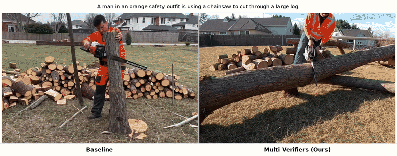

# <div align="center">🎬 LTX2-ITS: Inference Time Scaling for Joint Audio-Video Generation</div>

<div align="center">

**[Jaemin Jung](https://jung-jaemin.github.io/)**<sup>1</sup> • [Kyeongha Rho](https://kyeongharho.github.io/)<sup>1</sup> • [Inkyu Shin](https://dlsrbgg33.github.io/)<sup>2</sup> • [Joon Son Chung](https://mm.kaist.ac.kr/joon/)<sup>1</sup>

<sup>1</sup> [KAIST](https://www.kaist.ac.kr/) | <sup>2</sup> [Luma AI](https://lumalabs.ai/)

<br>

[](https://arxiv.org/abs/2606.03183)
[](https://jung-jaemin.github.io/ITS-AVGen-Proj/)
[](https://github.com/kaistmm/ITS-AVGen-LTX2)

</div>

---

<p align="center">
  
</p>

---

## 📋 Table of Contents

- [🎬 LTX2-ITS: Inference Time Scaling for Joint Audio-Video Generation](#-ltx2-its-inference-time-scaling-for-joint-audio-video-generation)
  - [📋 Table of Contents](#-table-of-contents)
  - [Overview](#overview)
  - [Key Features](#key-features)
  - [Supported Models](#supported-models)
  - [Prerequisites](#prerequisites)
  - [🚀 Getting Started](#-getting-started)
    - [Installation](#installation)
    - [Model Weights](#model-weights)
      - [Main Model (Choose One)](#main-model-choose-one)
      - [Supporting Models](#supporting-models)
    - [Reward Server Setup](#reward-server-setup)
    - [Verification](#verification)
  - [Inference Guide](#inference-guide)
    - [Reward Server Setup](#reward-server-setup-1)
      - [Start the Server](#start-the-server)
      - [Server Configuration](#server-configuration)
    - [Standard Inference](#standard-inference)
    - [BON (Best-of-N)](#bon-best-of-n)
    - [Advanced Settings](#advanced-settings)
      - [Reward Metrics](#reward-metrics)
      - [Aggregation Methods](#aggregation-methods)
      - [ARW (Adaptive Reward Weighting)](#arw-adaptive-reward-weighting)
      - [Complete Configuration Example](#complete-configuration-example)
  - [Citation](#citation)
  - [Acknowledgments](#acknowledgments)

---

## Overview

<p align="center">
  <a href="assets/src/main.pdf" target="_blank">
    
  </a>
</p>

**Inference Time Scaling (ITS)** is a post-hoc optimization technique that enhances audio-video generation quality **without additional training**. By leveraging pre-trained reward models at inference time, ITS produces superior results compared to standard generation pipelines.

**How it works:**
1. Generate a diverse population of candidates through diffusion
2. Score each candidate using reward signals (video quality, audio-video sync, etc.)
3. Iteratively refine the best candidates through evolutionary strategies
4. Return the highest-quality sample

---

## Key Features

| Feature | Description |
|---------|-------------|
| 🚀 **No Retraining** | Works with any pre-trained LTX-2 model out-of-the-box |
| 🎯 **BON (Best-of-N)** | Generate N candidates and select the best using reward ranking |
| ⚖️ **ARW** | Adaptive Reward Weighting for dynamic metric combination |
| 📊 **Multi-Reward** | Combine VideoReward, JavisScore, CLAP, and more |
| ⚡ **Production-Ready** | Optimized for high-resolution output (480p, 720p, 1080p) |
| 🔧 **Flexible Config** | Fine-tune all parameters via JSON configuration |
| 💾 **Memory Efficient** | FP8 quantization and sequential processing modes |

---

## Supported Models

| Model | Status | Base | Best For |
|-------|--------|------|----------|
| **[LTX2-ITS](https://github.com/kaistmm/ITS-AVGen-LTX2)** ⭐ | ✅ Active | [LTX-2.3](https://github.com/Lightricks/LTX-2) | SOTA quality & sync |
| **[JavisDiT-ITS](https://github.com/kaistmm/ITS-AVGen)** | ✅ Available | [JavisDiT](https://github.com/JavisVerse/JavisDiT) | Spatio-temporal priors |
| **MMDisCo-ITS** | 🔜 Coming | [MMDisCo](https://github.com/SonyResearch/MMDisCo) | Discriminator-guided |

📖 **Base Model Info:** Refer to [LTX-2 Repository](https://github.com/Lightricks/LTX-2) for detailed model documentation and capabilities.

---

## Prerequisites

Before installation, ensure you have:

| Requirement | Version | Notes |
|-------------|---------|-------|
| **Python** | 3.10+ | Required for environment setup |
| **CUDA** | 12.1 | Tested on CUDA 12.1, may work on 11.8+ |
| **cuDNN** | 8.x | For CUDA compatibility |
| **GPU VRAM** | 24GB+ | See GPU Recommendations below |
| **Disk Space** | 200GB+ | For models, checkpoints, and outputs |
| **ffmpeg** | Latest | For video processing |

---

## 🚀 Getting Started

### Installation

```bash
# Clone the LTX-2 ITS repository
git clone https://github.com/kaistmm/ITS-AVGen-LTX2.git
cd ITS-AVGen-LTX2

# Create Python environment
uv sync --frozen
source .venv/bin/activate
```

### Model Weights

Download from the [LTX-2.3 HuggingFace Repository](https://huggingface.co/Lightricks/LTX-2.3):

#### Main Model (Choose One)

| Model | Quality | Speed |
|-------|---------|-------|
| **Development** | ✅ Better | — |
| **Distilled** | Good | ⚡ 2-3x faster |

```bash
mkdir -p checkpoints/LTX2.3 && cd checkpoints/LTX2.3

# Development (better quality)
wget https://huggingface.co/Lightricks/LTX-2.3/resolve/main/ltx-2.3-22b-dev.safetensors

# Distilled (faster) — or download this instead
wget https://huggingface.co/Lightricks/LTX-2.3/resolve/main/ltx-2.3-22b-distilled.safetensors

cd ../..
```

> 💡 **Select which model to use** by editing `CHECKPOINT_PATH` in [`scripts/inference_one_ltx_bon.sh`](scripts/inference_one_ltx_bon.sh):
> ```bash
> CHECKPOINT_PATH="${CHECKPOINT_PATH:-./checkpoints/LTX2.3/ltx-2.3-22b-distilled.safetensors}" \
> ```
> Change the path to `ltx-2.3-22b-dev.safetensors` for the development model.

#### Supporting Models

```bash
# Gemma-3 Text Encoder
mkdir -p checkpoints/LTX2/gemma3
# Download from: https://huggingface.co/google/gemma-3-12b-it-qat-q4_0-unquantized
# Place in checkpoints/LTX2/gemma3/
```

### Reward Server Setup

We recommend creating a **separate environment** for reward models to use across multiple generation models (JavisDiT, LTX2, etc.). However, you can also work within a single environment if preferred.

```bash
# Setup VideoAlign environment
cd VideoAlign
conda env create -f environment.yaml
conda activate VideoReward
pip install flash-attn==2.5.8 --no-build-isolation
cd ..

# Install additional dependencies
pip install "setuptools<81" --force-reinstall
pip install git+https://github.com/facebookresearch/ImageBind.git

# Download model checkpoints
mkdir -p checkpoints
cd checkpoints
git clone https://huggingface.co/KwaiVGI/VideoReward
wget https://dl.fbaipublicfiles.com/imagebind/imagebind_huge.pth -O imagebind_huge.pth
cd ..
```

### Verification

Test your installation with a quick inference run:

```bash
# Terminal 1: Start reward server (if using ITS)
conda activate VideoReward
bash scripts/vqa_server.sh 0
# ✓ Should output: "Server started... Listening on port 5002"

# Terminal 2: Run test inference
source .venv/bin/activate
bash scripts/inference_one_ltx.sh 0
# ✓ Output videos saved to configured directory
```

✅ If both complete successfully, installation is complete!

---

## Inference Guide

### Reward Server Setup

The reward server handles all quality evaluation and must be running for ITS modes (BON, ARW).

#### Start the Server

```bash
# Terminal 1: Launch reward server on GPU 0
conda activate reward-server
bash scripts/vqa_server.sh 0
```

> 📌 **Server runs on port 5002** — Keep this terminal open during inference

#### Server Configuration

```bash
# Advanced configuration (edit directly)
CUDA_VISIBLE_DEVICES=0 python reward_model/vqa_server.py \
    --gpu 0 \
    --addr 5002 \
    --reward_model VideoReward \
    --align_model JavisScore
```

| Option | Available Values | Default | Purpose |
|--------|------------------|---------|---------|
| `--reward_model` | `VideoReward` \| `vqascore` | `VideoReward` | Video quality metric |
| `--align_model` | `JavisScore` \| `AVHScore` \| `AVIB` \| `All` \| `None` | `JavisScore` | Audio-video sync metrics |

**Common Configurations:**

| Use Case | Command |
|----------|---------|
| **Standard (Default)** | `bash scripts/vqa_server.sh 0` |
| **All Metrics** | `CUDA_VISIBLE_DEVICES=0 python reward_model/vqa_server.py --gpu 0 --addr 5002 --align_model All` |
| **Quality Only** | `CUDA_VISIBLE_DEVICES=0 python reward_model/vqa_server.py --gpu 0 --addr 5002 --align_model None` |

---

### Standard Inference

**Use this for:** Fast single-sample generation without quality optimization

```bash
# Terminal 2: Run inference
source .venv/bin/activate

# Single GPU (GPU 0)
bash scripts/inference_one_ltx.sh 0

# Single GPU with custom resolution
HEIGHT=256 WIDTH=256 bash scripts/inference_one_ltx.sh 1

# Multi-GPU distributed processing (4 GPUs)
for i in {0..3}; do 
    bash scripts/inference_one_ltx.sh $i 4 $i & 
done
wait
```

**Arguments:**
```
bash scripts/inference_one_ltx.sh [GPU_ID] [NSHARD] [SHARD_ID]

GPU_ID    : GPU device number (0, 1, 2, ...)
NSHARD    : Total number of shards for distributed processing (default: 1)
SHARD_ID  : Current shard index (default: 0)
```

**Environment Variables:**
```bash
HEIGHT=512                  # Video height (default: 512)
WIDTH=768                   # Video width (default: 768)
USE_FP8_CAST=1              # Enable FP8 quantization (default: 1)
BATCH_MODEL_MODE=reuse      # Model loading strategy (default: reuse)
```

**`BATCH_MODEL_MODE` — Model Loading Strategy:**

Controls how models are kept in GPU memory when processing multiple prompts.

| Mode | Behavior | Speed | VRAM | Recommended For |
|------|----------|-------|------|-----------------|
| `reuse` (default) | Load all models once, reuse across prompts | Fast | High | 48GB+ GPUs |
| `reload` | Load/free each model per generation | Slower | Low | 24GB GPUs (RTX 4090) |

```bash
# Memory-efficient mode for limited VRAM
BATCH_MODEL_MODE=reload bash scripts/inference_one_ltx.sh 0
```

**Output:**
- Single video per prompt
- Fastest inference
- No reward model evaluation

---

### BON (Best-of-N)

**Use this for:** Generate multiple candidates and select the best using reward scores

```bash
# Terminal 2: Run BON inference
source .venv/bin/activate

# Single GPU (GPU 0)
bash scripts/inference_one_ltx_bon.sh 0

# Multi-GPU distributed processing (4 GPUs)
for i in {0..3}; do 
    bash scripts/inference_one_ltx_bon.sh $i 4 $i & 
done
wait
```

**Arguments:**
```
bash scripts/inference_one_ltx_bon.sh [GPU_ID] [NSHARD] [SHARD_ID]

GPU_ID    : GPU device number (0, 1, 2, ...)
NSHARD    : Total number of shards for distributed processing (default: 1)
SHARD_ID  : Current shard index (default: 0)
```

**Prerequisites:**
- Reward server must be running: `conda activate VideoReward && bash scripts/vqa_server.sh [GPU]`
- Configuration file: `scripts/inference_one_ltx_bon_config.json`

**How BON Works:**
1. Generate `N` diverse candidates from same prompt
2. Score each using reward server
3. Rank by combined score (video quality + audio-video sync)
4. Return the best candidate

**Config File:** `scripts/inference_one_ltx_bon_config.json`

```json
{
  "BON_SAMPLES": 10,
  "BON_AGGREGATION_METHOD": "arw",
  "BON_REWARD_KEY": "TA",
  "BON_ALIGN_KEY": "JS",
  "BON_REWARD_WEIGHT": 0.5,
  "BON_ALIGN_WEIGHT": 0.5
}
```

| Parameter | Type | Default | Description |
|-----------|------|---------|-------------|
| `BON_SAMPLES` | int | 10 | Number of candidates to generate |
| `BON_AGGREGATION_METHOD` | str | `arw` | Score combination method |
| `BON_REWARD_KEY` | str | `TA` | Primary metric |
| `BON_ALIGN_KEY` | str | `JS` | Alignment metric |
| `BON_REWARD_WEIGHT` | float | 0.5 | Weight for primary metric (0.0-1.0) |
| `BON_ALIGN_WEIGHT` | float | 0.5 | Weight for alignment metric (0.0-1.0) |

---

### Advanced Settings

#### Reward Metrics

Available metrics for evaluation:

| Metric | Symbol | Purpose | Notes |
|--------|--------|---------|-------|
| **Temporal Alignment** | `TA` | Audio-video synchronization | Measures sync quality |
| **JavisScore** | `JS` | Audio-visual harmony | Image-audio alignment |
| **VideoReward** | `VR` | Overall video quality | General quality metric |
| **CLAP** | `CLAP` | Audio-prompt alignment | Prompt consistency |

#### Aggregation Methods

Different strategies for combining multiple reward scores:

| Method | Formula | Use Case |
|--------|---------|----------|
| **Weighted** | `w1*TA + w2*JS` | Simple linear combination |
| **Rank** | Rank-based normalization | Robust to metric ranges |
| **ARW** ⭐ | Learnable adaptive weights | Auto-optimize weights (recommended) |

#### ARW (Adaptive Reward Weighting)

Automatically learns optimal metric weights during inference:

```json
{
  "BON_AGGREGATION_METHOD": "arw",
  "BON_ARW_LR": 0.05,
  "BON_ARW_MAX_ITER": 5,
  "BON_ARW_OPTIMIZER": "Adam"
}
```

| Parameter | Default | Range | Tuning Guide |
|-----------|---------|-------|--------------|
| `BON_ARW_LR` | 0.05 | 0.01-0.1 | ↑ Faster convergence, ↓ More stable |
| `BON_ARW_MAX_ITER` | 5 | 1-10 | ↑ Better weights, ↓ Faster inference |
| `BON_ARW_OPTIMIZER` | `Adam` | Adam \| SGD | Adam recommended for most cases |

#### Complete Configuration Example

```json
{
  "BON_SAMPLES": 10,
  "BON_AGGREGATION_METHOD": "arw",
  
  "BON_REWARD_KEY": "TA",
  "BON_ALIGN_KEY": "JS",
  "BON_REWARD_WEIGHT": 0.4,
  "BON_ALIGN_WEIGHT": 0.6,
  
  "BON_ARW_LR": 0.05,
  "BON_ARW_MAX_ITER": 5,
  "BON_ARW_OPTIMIZER": "Adam"
}
```

---

## Citation

If you find this work useful, please cite:

```bibtex
@article{jung2026inference,
  title={Inference-Time Scaling for Joint Audio-Video Generation},
  author={Jung, Jaemin and Rho, Kyeongha and Shin, Inkyu and Chung, Joon Son},
  journal={arXiv preprint arXiv:2606.03183},
  year={2026}
}
```

---


## Acknowledgments

- [Lightricks](https://lumalabs.ai/) for LTX-2 model
- [Facebook Research](https://research.facebook.com/) for ImageBind
- [Kwai VGI](https://github.com/KwaiVGI/) for VideoReward

---

